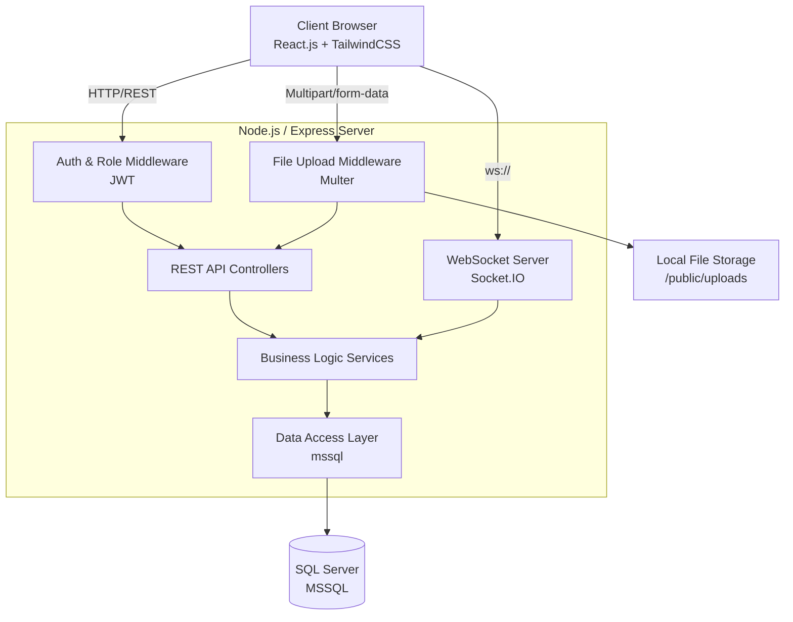
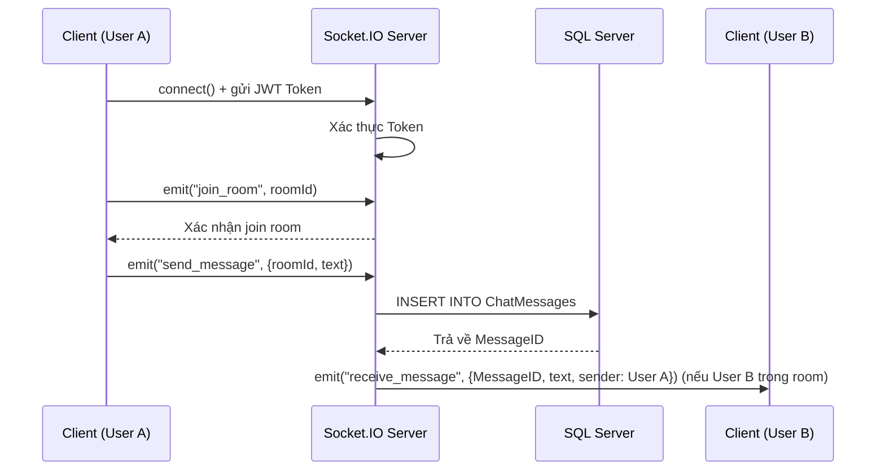

# System Architecture – ZenTek Exchange

**Trạng thái**: Draft
**Ngày tạo**: 2026-05-24
**Tạo bởi**: Software Architect Agent

---

## 1. High-Level Architecture

Hệ thống được thiết kế theo mô hình Client-Server (Monolithic Backend kết hợp Real-time qua WebSocket). Do đây là đồ án sinh viên, kiến trúc ưu tiên tính đơn giản, dễ triển khai nhưng vẫn đảm bảo tách biệt rõ ràng giữa Frontend và Backend.

## 2. Flow Xử lý Chat Đa dạng (WebSocket)

ZenTek hỗ trợ 3 loại chat (Cộng đồng, 1-1 Buyer-Seller, 1-1 User-User). Tất cả đều chung một kiến trúc Socket.IO Room.

## 3. Storage Architecture

Để tối ưu chi phí và đơn giản hóa môi trường Local, file hình ảnh (Avatar, Ảnh sản phẩm) sẽ được upload và lưu trữ cục bộ tại server backend.

1. Client gửi request `multipart/form-data`.
2. Middleware `multer` nhận file, lưu vào thư mục `public/uploads/products/` hoặc `public/uploads/avatars/`.
3. Backend lấy filename/path do `multer` sinh ra, lưu chuỗi URL tĩnh (ví dụ: `/uploads/products/12345.jpg`) vào SQL Server.
4. Client hiển thị ảnh thông qua việc truy cập trực tiếp Static File Server của Express (`express.static('public')`).

## 4. Security Architecture

- **Authentication**: Stateless với JSON Web Token (JWT). Token được lưu ở `localStorage` hoặc `httpOnly cookie` ở phía Client.
- **Password Hashing**: `bcrypt` với vòng lặp salt (10 rounds).
- **Authorization**: Middleware kiểm tra `VaiTro` (Role) trong JWT Payload trước khi cho phép vào các route đặc thù (`/api/admin/*` chỉ dành cho Admin, `/api/seller/*` chỉ dành cho Seller).
- **Socket Security**: Yêu cầu truyền JWT Token vào lúc handshake connection. Ngắt kết nối ngay nếu token không hợp lệ.
