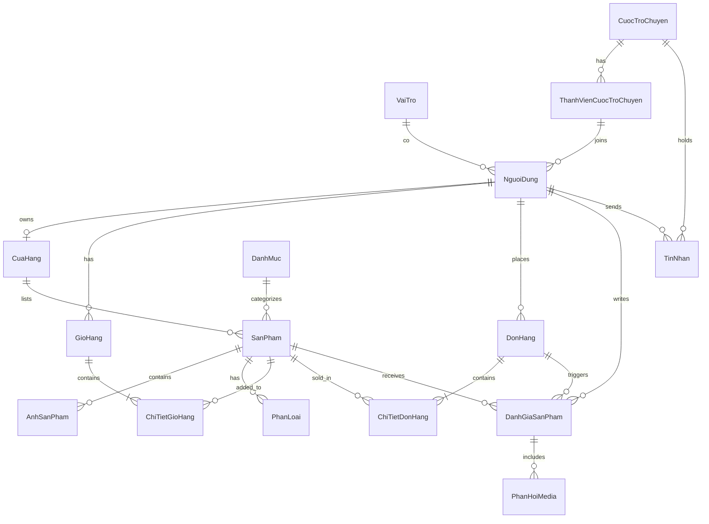

Dưới đây là toàn bộ cơ sở dữ liệu từ **#1** được định dạng lại theo phong cách của **#2** (bảng markdown, có cột `Null`, `Ràng buộc`, kèm theo ghi chú index).

````markdown
# Database Schema (MSSQL) – ZenTek Exchange (Chi tiết)

**Trạng thái**: Draft  
**Ngày tạo**: 2026-05-24  
**Tạo bởi**: Database Designer Agent

---

## 1. Entity Relationship Diagram (ERD)


````

---

## 2. Bảng chi tiết (Table Specifications)

### Bảng `VaiTro`

| Tên Cột   | Kiểu Dữ Liệu     | Null | Ràng Buộc           | Mô tả                                  |
| --------- | ---------------- | ---- | ------------------- | -------------------------------------- |
| MaVaiTro  | UNIQUEIDENTIFIER | No   | PK, DEFAULT NEWID() | Mã vai trò                             |
| TenVaiTro | NVARCHAR(50)     | No   | UNIQUE, NOT NULL    | Tên vai trò (ví dụ: sinhvien, quantri) |
| MoTa      | NVARCHAR(255)    | Yes  | NULL                | Mô tả chi tiết vai trò                 |

### Bảng `NguoiDung`

| Tên Cột     | Kiểu Dữ Liệu     | Null | Ràng Buộc                       | Mô tả              |
| ----------- | ---------------- | ---- | ------------------------------- | ------------------ |
| MaNguoiDung | UNIQUEIDENTIFIER | No   | PK, DEFAULT NEWID()             | Mã người dùng      |
| TenDangNhap | VARCHAR(12)      | No   | UNIQUE, NOT NULL                | Tên đăng nhập      |
| MatKhauHash | VARCHAR(255)     | No   | NOT NULL                        | Mật khẩu (đã hash) |
| Email       | VARCHAR(100)     | No   | UNIQUE, NOT NULL                | Email              |
| HoTen       | NVARCHAR(100)    | No   | NOT NULL                        | Họ và tên          |
| SoDienThoai | CHAR(10)         | Yes  | NULL                            | Số điện thoại      |
| VaiTroId    | UNIQUEIDENTIFIER | No   | FK → VaiTro(MaVaiTro), NOT NULL | Mã vai trò         |
| AnhDaiDien  | VARCHAR(MAX)     | Yes  | NULL                            | Ảnh đại diện       |
| NgayTao     | DATETIME         | No   | DEFAULT GETDATE()               | Ngày tạo           |
| NgayCapNhat | DATETIME         | Yes  | NULL                            | Ngày cập nhật      |

### Bảng `CuaHang`

| Tên Cột         | Kiểu Dữ Liệu     | Null | Ràng Buộc                           | Mô tả                                         |
| --------------- | ---------------- | ---- | ----------------------------------- | --------------------------------------------- |
| MaCuaHang       | UNIQUEIDENTIFIER | No   | PK, DEFAULT NEWID()                 | Mã cửa hàng                                   |
| NguoiBanId      | UNIQUEIDENTIFIER | No   | FK → NguoiDung(MaNguoiDung), UNIQUE | Mã người bán (1 người chỉ có 1 cửa hàng)      |
| TenCuaHang      | NVARCHAR(50)     | No   | NOT NULL                            | Tên hiển thị của shop                         |
| MoTa            | NVARCHAR(500)    | Yes  | NULL                                | Giới thiệu ngắn                               |
| Logo            | VARCHAR(255)     | Yes  | NULL                                | Đường dẫn ảnh logo                            |
| DiaChi          | NVARCHAR(300)    | No   | NOT NULL                            | Địa chỉ cụ thể                                |
| PhuongXa        | NVARCHAR(100)    | No   | NOT NULL                            | Phường / Xã                                   |
| QuanHuyen       | NVARCHAR(100)    | No   | NOT NULL                            | Quận / Huyện                                  |
| TinhThanh       | NVARCHAR(100)    | No   | NOT NULL                            | Tỉnh / Thành phố                              |
| SoDienThoai     | CHAR(10)         | No   | NOT NULL                            | SĐT liên hệ shop                              |
| LoaiHinhCuaHang | TINYINT          | No   | NOT NULL DEFAULT 1                  | 1: Cá nhân, 2: Hộ kinh doanh, 3: Doanh nghiệp |
| MaSoThue        | NVARCHAR(20)     | Yes  | NULL                                | Mã số thuế (nếu có)                           |
| PdfGiayPhep     | VARCHAR(255)     | Yes  | NULL                                | Đường dẫn file PDF giấy phép kinh doanh       |
| DaXacThucPhapLy | BIT              | No   | NOT NULL DEFAULT 0                  | 0: Chưa xác thực, 1: Đã xác thực              |
| LyDoTuChoi      | NVARCHAR(500)    | Yes  | NULL                                | Lý do admin từ chối xác thực                  |
| NgayTao         | DATETIME         | No   | DEFAULT GETDATE()                   | Ngày tạo                                      |
| TrangThai       | BIT              | No   | DEFAULT 1                           | 1: Hoạt động, 0: Tạm khóa                     |

### Bảng `DanhMuc`

| Tên Cột      | Kiểu Dữ Liệu     | Null | Ràng Buộc                     | Mô tả           |
| ------------ | ---------------- | ---- | ----------------------------- | --------------- |
| MaDanhMuc    | UNIQUEIDENTIFIER | No   | PK, DEFAULT NEWID()           | Mã danh mục     |
| TenDanhMuc   | NVARCHAR(100)    | No   | NOT NULL                      | Tên danh mục    |
| MoTa         | NVARCHAR(MAX)    | Yes  | NULL                          | Mô tả           |
| DanhMucChaId | UNIQUEIDENTIFIER | Yes  | FK → DanhMuc(MaDanhMuc), NULL | Danh mục cha    |
| Icon         | VARCHAR(MAX)     | No   | NOT NULL                      | Icon / ảnh      |
| ThuTuHienThi | INT              | No   | DEFAULT 1                     | Thứ tự hiển thị |
| NgayTao      | DATETIME         | No   | DEFAULT GETDATE()             | Ngày tạo        |

### Bảng `SanPham`

| Tên Cột          | Kiểu Dữ Liệu     | Null | Ràng Buộc                                                                                               | Mô tả                         |
| ---------------- | ---------------- | ---- | ------------------------------------------------------------------------------------------------------- | ----------------------------- |
| MaSanPham        | UNIQUEIDENTIFIER | No   | PK, DEFAULT NEWID()                                                                                     | Mã sản phẩm                   |
| CuaHangId        | UNIQUEIDENTIFIER | No   | FK → CuaHang(MaCuaHang), NOT NULL                                                                       | Cửa hàng bán                  |
| DanhMucId        | UNIQUEIDENTIFIER | No   | FK → DanhMuc(MaDanhMuc), NOT NULL                                                                       | Danh mục sản phẩm             |
| TieuDe           | NVARCHAR(200)    | No   | NOT NULL                                                                                                | Tiêu đề sản phẩm              |
| FileMoTa         | NVARCHAR(MAX)    | Yes  | NULL                                                                                                    | Đường dẫn file mô tả chi tiết |
| Gia              | DECIMAL(12,2)    | No   | NOT NULL                                                                                                | Giá bán (VNĐ)                 |
| TinhTrang        | NVARCHAR(10)     | No   | NOT NULL, CHECK (TinhTrang IN (N'Mới', N'Cũ'))                                                          | Tình trạng sản phẩm           |
| SoLuong          | INT              | No   | DEFAULT 1                                                                                               | Tồn kho                       |
| SoLuongDaBan     | INT              | No   | DEFAULT 0                                                                                               | Đã bán                        |
| LuotXem          | INT              | No   | DEFAULT 0                                                                                               | Lượt xem                      |
| DiemDanhGia      | DECIMAL(1,1)     | No   | DEFAULT 0.0                                                                                             | Điểm đánh giá TB              |
| LinkSanPham      | VARCHAR(500)     | Yes  | NULL                                                                                                    | Đường dẫn trang SP            |
| SoLuongGioHang   | INT              | No   | DEFAULT 0                                                                                               | Số lượng tối đa thêm giỏ      |
| TrangThaiDuyet   | NVARCHAR(20)     | No   | DEFAULT 'cho_duyet', CHECK (TrangThaiDuyet IN (N'Chờ phê duyệt', N'Đã duyệt', N'Đã từ chối', N'Đã gỡ')) | Trạng thái duyệt              |
| NguoiDuyetId     | UNIQUEIDENTIFIER | Yes  | FK → NguoiDung(MaNguoiDung)                                                                             | Người duyệt                   |
| NgayDuyet        | DATETIME         | Yes  | NULL                                                                                                    | Ngày duyệt                    |
| TrangThaiHienThi | BIT              | No   | DEFAULT 1                                                                                               | 1: Hiển thị, 0: Ẩn            |
| NgayDang         | DATETIME         | No   | DEFAULT GETDATE()                                                                                       | Ngày đăng                     |
| NgaySua          | DATETIME         | Yes  | NULL                                                                                                    | Ngày sửa gần nhất             |
| DaHetHang        | BIT              | No   | DEFAULT 0                                                                                               | 0: Còn, 1: Hết                |

### Bảng `AnhSanPham`

| Tên Cột     | Kiểu Dữ Liệu     | Null | Ràng Buộc               | Mô tả             |
| ----------- | ---------------- | ---- | ----------------------- | ----------------- |
| MaHinhAnh   | UNIQUEIDENTIFIER | No   | PK, DEFAULT NEWID()     | Mã hình ảnh       |
| SanPhamId   | UNIQUEIDENTIFIER | No   | FK → SanPham(MaSanPham) | Sản phẩm chứa ảnh |
| DuongDanAnh | VARCHAR(500)     | No   | NOT NULL                | Đường dẫn ảnh     |
| LaAnhChinh  | BIT              | No   | DEFAULT 0               | Ảnh đại diện      |
| NgayTao     | DATETIME         | No   | DEFAULT GETDATE()       | Ngày tải lên      |

### Bảng `PhanLoai`

| Tên Cột     | Kiểu Dữ Liệu     | Null | Ràng Buộc                            | Mô tả                      |
| ----------- | ---------------- | ---- | ------------------------------------ | -------------------------- |
| MaPhanLoai  | UNIQUEIDENTIFIER | No   | PK, DEFAULT NEWID()                  | Mã phân loại               |
| TenPhanLoai | NVARCHAR(100)    | No   | NOT NULL                             | Tên phân loại (màu, size)  |
| SanPhamId   | UNIQUEIDENTIFIER | No   | FK → SanPham(MaSanPham), NOT NULL    | Sản phẩm cha               |
| HinhAnhId   | UNIQUEIDENTIFIER | No   | FK → AnhSanPham(MaHinhAnh), NOT NULL | Ảnh đại diện cho phân loại |

### Bảng `GioHang`

| Tên Cột     | Kiểu Dữ Liệu     | Null | Ràng Buộc                                     | Mô tả                     |
| ----------- | ---------------- | ---- | --------------------------------------------- | ------------------------- |
| MaGioHang   | UNIQUEIDENTIFIER | No   | PK, DEFAULT NEWID()                           | Mã giỏ hàng               |
| NguoiMuaId  | UNIQUEIDENTIFIER | No   | FK → NguoiDung(MaNguoiDung), UNIQUE, NOT NULL | Người mua (1 người 1 giỏ) |
| NgayTao     | DATETIME         | No   | DEFAULT GETDATE()                             | Ngày tạo giỏ              |
| NgayCapNhat | DATETIME         | No   | DEFAULT GETDATE()                             | Ngày cập nhật             |

### Bảng `ChiTietGioHang`

| Tên Cột          | Kiểu Dữ Liệu     | Null | Ràng Buộc                           | Mô tả                |
| ---------------- | ---------------- | ---- | ----------------------------------- | -------------------- |
| MaChiTietGioHang | UNIQUEIDENTIFIER | No   | PK, DEFAULT NEWID()                 | Mã chi tiết          |
| GioHangId        | UNIQUEIDENTIFIER | No   | FK → GioHang(MaGioHang), NOT NULL   | Giỏ hàng             |
| SanPhamId        | UNIQUEIDENTIFIER | No   | FK → SanPham(MaSanPham), NOT NULL   | Sản phẩm             |
| PhanLoaiId       | UNIQUEIDENTIFIER | No   | FK → PhanLoai(MaPhanLoai), NOT NULL | Phân loại            |
| SoLuong          | INT              | No   | NOT NULL DEFAULT 1                  | Số lượng             |
| DonGia           | DECIMAL(12,2)    | No   | NOT NULL                            | Đơn giá (copy từ SP) |

### Bảng `DonHang`

| Tên Cột              | Kiểu Dữ Liệu     | Null | Ràng Buộc                                                                                                 | Mô tả             |
| -------------------- | ---------------- | ---- | --------------------------------------------------------------------------------------------------------- | ----------------- |
| MaDonHang            | UNIQUEIDENTIFIER | No   | PK, DEFAULT NEWID()                                                                                       | Mã đơn hàng       |
| NguoiMuaId           | UNIQUEIDENTIFIER | No   | FK → NguoiDung(MaNguoiDung), NOT NULL                                                                     | Người mua         |
| HoTenNguoiNhan       | NVARCHAR(100)    | No   | NOT NULL                                                                                                  | Tên người nhận    |
| SoDienThoaiNguoiNhan | CHAR(10)         | No   | NOT NULL                                                                                                  | SĐT người nhận    |
| DiaChiNhan           | NVARCHAR(255)    | No   | NOT NULL                                                                                                  | Địa chỉ giao hàng |
| TrangThaiDon         | NVARCHAR(20)     | No   | NOT NULL DEFAULT 'cho_xu_ly', CHECK (TrangThaiDon IN (N'Chờ xử lý', N'Đã hủy', N'Đang giao', N'Đã nhận')) | Trạng thái        |
| LyDoHuy              | NVARCHAR(500)    | Yes  | NULL                                                                                                      | Lý do hủy         |
| NgayTao              | DATETIME         | No   | DEFAULT GETDATE()                                                                                         | Ngày tạo          |
| NgayCapNhat          | DATETIME         | No   | DEFAULT GETDATE()                                                                                         | Ngày cập nhật     |

### Bảng `ChiTietDonHang`

| Tên Cột          | Kiểu Dữ Liệu     | Null | Ràng Buộc                         | Mô tả       |
| ---------------- | ---------------- | ---- | --------------------------------- | ----------- |
| MaChiTietDonHang | UNIQUEIDENTIFIER | No   | PK, DEFAULT NEWID()               | Mã chi tiết |
| DonHangId        | UNIQUEIDENTIFIER | No   | FK → DonHang(MaDonHang), NOT NULL | Đơn hàng    |
| SanPhamId        | UNIQUEIDENTIFIER | No   | FK → SanPham(MaSanPham), NOT NULL | Sản phẩm    |
| PhanLoaiId       | UNIQUEIDENTIFIER | No   | FK → PhanLoai(MaPhanLoai), NULL   | Phân loại   |
| SoLuong          | INT              | No   | NOT NULL DEFAULT 1                | Số lượng    |
| DonGia           | DECIMAL(12,2)    | No   | NOT NULL                          | Đơn giá     |
| GhiChu           | NVARCHAR(255)    | Yes  | NULL                              | Ghi chú     |

### Bảng `DanhGiaSanPham`

| Tên Cột           | Kiểu Dữ Liệu     | Null | Ràng Buộc                               | Mô tả                  |
| ----------------- | ---------------- | ---- | --------------------------------------- | ---------------------- |
| MaDanhGia         | UNIQUEIDENTIFIER | No   | PK, DEFAULT NEWID()                     | Mã đánh giá            |
| SanPhamId         | UNIQUEIDENTIFIER | No   | FK → SanPham(MaSanPham), NOT NULL       | Sản phẩm               |
| NguoiMuaId        | UNIQUEIDENTIFIER | No   | FK → NguoiDung(MaNguoiDung), NOT NULL   | Người mua              |
| DonHangId         | UNIQUEIDENTIFIER | No   | FK → DonHang(MaDonHang), NOT NULL       | Đơn hàng               |
| SoSao             | TINYINT          | No   | NOT NULL, CHECK (SoSao BETWEEN 1 AND 5) | Số sao                 |
| NoiDung           | NVARCHAR(MAX)    | Yes  | NULL                                    | Nhận xét               |
| DuongDanVideo     | VARCHAR(500)     | Yes  | NULL                                    | Video đánh giá         |
| HuuIch            | INT              | No   | DEFAULT 0                               | Đánh giá hữu ích       |
| NgayTao           | DATETIME         | No   | DEFAULT GETDATE()                       | Ngày đánh giá          |
| NgayCapNhat       | DATETIME         | Yes  | NULL                                    | Ngày sửa               |
| TraLoiNoiDung     | NVARCHAR(MAX)    | Yes  | NULL                                    | Phản hồi của người bán |
| TraLoiNgayTao     | DATETIME         | Yes  | NULL                                    | Ngày phản hồi          |
| TraLoiNgayCapNhat | DATETIME         | Yes  | NULL                                    | Ngày sửa phản hồi      |

### Bảng `PhanHoiMedia`

| Tên Cột       | Kiểu Dữ Liệu     | Null | Ràng Buộc                                                 | Mô tả                         |
| ------------- | ---------------- | ---- | --------------------------------------------------------- | ----------------------------- |
| MaPhanHoi     | UNIQUEIDENTIFIER | No   | PK, DEFAULT NEWID()                                       | Mã phản hồi media             |
| DanhGiaId     | UNIQUEIDENTIFIER | Yes  | FK → DanhGiaSanPham(MaDanhGia), NULL                      | Đánh giá (nếu thuộc đánh giá) |
| TinNhanId     | UNIQUEIDENTIFIER | Yes  | FK → TinNhan(MaTinNhan), NULL                             | Tin nhắn (nếu thuộc tin nhắn) |
| LoaiPhanHoi   | NVARCHAR(20)     | No   | NOT NULL, CHECK (LoaiPhanHoi IN ('danh_gia', 'tin_nhan')) | Loại phản hồi                 |
| LoaiMedia     | NVARCHAR(10)     | No   | NOT NULL, CHECK (LoaiMedia IN ('anh', 'video'))           | Loại media                    |
| DuongDanMedia | VARCHAR(500)     | No   | NOT NULL                                                  | Đường dẫn ảnh hoặc video      |
| NgayTao       | DATETIME         | No   | DEFAULT GETDATE()                                         | Ngày tải lên                  |

### Bảng `CuocTroChuyen`

| Tên Cột          | Kiểu Dữ Liệu     | Null | Ràng Buộc                                                       | Mô tả                   |
| ---------------- | ---------------- | ---- | --------------------------------------------------------------- | ----------------------- |
| MaCuocTroChuyen  | UNIQUEIDENTIFIER | No   | PK, DEFAULT NEWID()                                             | Mã cuộc trò chuyện      |
| TenCuocTroChuyen | NVARCHAR(255)    | Yes  | NULL                                                            | Tên nhóm (nếu là nhóm)  |
| Loai             | NVARCHAR(20)     | No   | NOT NULL DEFAULT 'ca_nhan', CHECK (Loai IN ('ca_nhan', 'nhom')) | Loại: cá nhân hoặc nhóm |
| TinNhanCuoiId    | UNIQUEIDENTIFIER | Yes  | FK → TinNhan(MaTinNhan), NULL                                   | Tin nhắn cuối (preview) |
| NgayTao          | DATETIME         | No   | DEFAULT GETDATE()                                               | Thời gian tạo           |
| NgayCapNhat      | DATETIME         | No   | DEFAULT GETDATE()                                               | Thời gian cập nhật cuối |

### Bảng `ThanhVienCuocTroChuyen`

| Tên Cột         | Kiểu Dữ Liệu     | Null | Ràng Buộc                                                          | Mô tả                              |
| --------------- | ---------------- | ---- | ------------------------------------------------------------------ | ---------------------------------- |
| MaThanhVien     | UNIQUEIDENTIFIER | No   | PK, DEFAULT NEWID()                                                | Mã thành viên                      |
| CuocTroChuyenId | UNIQUEIDENTIFIER | No   | FK → CuocTroChuyen(MaCuocTroChuyen), NOT NULL                      | Cuộc trò chuyện                    |
| NguoiDungId     | UNIQUEIDENTIFIER | No   | FK → NguoiDung(MaNguoiDung), NOT NULL                              | Người dùng tham gia                |
| VaiTro          | NVARCHAR(20)     | No   | DEFAULT 'thanh_vien', CHECK (VaiTro IN ('chu_nhom', 'thanh_vien')) | Vai trò trong nhóm                 |
| NgayThamGia     | DATETIME         | No   | DEFAULT GETDATE()                                                  | Thời gian tham gia                 |
| _(unique)_      |                  |      | UNIQUE (CuocTroChuyenId, NguoiDungId)                              | Đảm bảo 1 người chỉ tham gia 1 lần |

### Bảng `TinNhan`

| Tên Cột         | Kiểu Dữ Liệu     | Null | Ràng Buộc                                     | Mô tả            |
| --------------- | ---------------- | ---- | --------------------------------------------- | ---------------- |
| MaTinNhan       | UNIQUEIDENTIFIER | No   | PK, DEFAULT NEWID()                           | Mã tin nhắn      |
| CuocTroChuyenId | UNIQUEIDENTIFIER | No   | FK → CuocTroChuyen(MaCuocTroChuyen), NOT NULL | Cuộc trò chuyện  |
| NguoiGuiId      | UNIQUEIDENTIFIER | No   | FK → NguoiDung(MaNguoiDung), NOT NULL         | Người gửi        |
| NoiDung         | NVARCHAR(MAX)    | Yes  | NULL                                          | Nội dung văn bản |
| DaDoc           | BIT              | No   | DEFAULT 0                                     | Đã xem chưa      |
| NgayGui         | DATETIME         | No   | DEFAULT GETDATE()                             | Thời gian gửi    |

---

## 3. Ghi chú & Indexing

- **Primary keys** đều là `UNIQUEIDENTIFIER` với `DEFAULT NEWID()`.
- Các **foreign key** cần được đánh index để tối ưu JOIN: `NguoiDung.VaiTroId`, `CuaHang.NguoiBanId`, `SanPham.CuaHangId`, `SanPham.DanhMucId`, `DonHang.NguoiMuaId`, `ChiTietDonHang.DonHangId`, `ChiTietDonHang.SanPhamId`, `DanhGiaSanPham.SanPhamId`, `TinNhan.CuocTroChuyenId`, `ThanhVienCuocTroChuyen.CuocTroChuyenId`, `ThanhVienCuocTroChuyen.NguoiDungId`.
- Index riêng cho các cột thường xuyên tìm kiếm/lọc:
  - `NguoiDung.TenDangNhap`, `NguoiDung.Email`
  - `SanPham.TrangThaiDuyet`, `SanPham.TrangThaiHienThi`
  - `DonHang.TrangThaiDon`
  - `CuocTroChuyen.Loai`, `CuocTroChuyen.NgayCapNhat`
- Với bảng `DanhGiaSanPham`, nên có composite index `(SanPhamId, NgayTao DESC)` để hiển thị đánh giá mới nhất.
- Các cột `CHECK` và `DEFAULT` đã được giữ nguyên theo thiết kế gốc.

```

```
