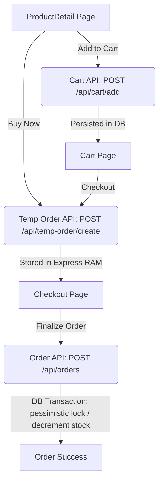
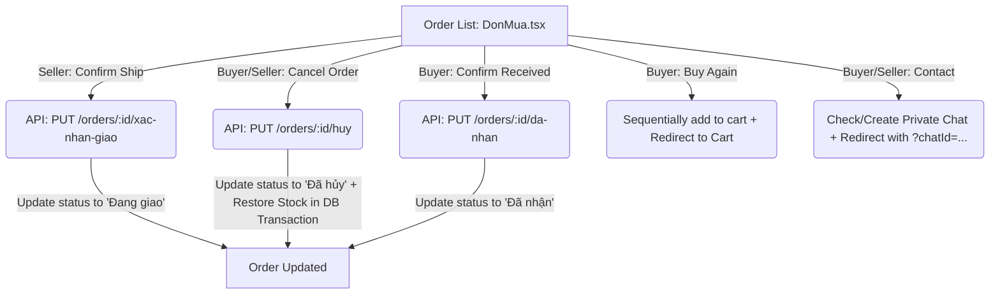

# System Memory: Purchase Flow (Luồng Mua Hàng)

This document serves as a persistent record of the purchase flow logic, design choices, and file architecture implemented for the Zentek Exchange platform.

---

## 1. Flow Overview



1. **Product Detail Page**:
   - Buyers can select specific classifications (variants).
   - "Thêm giỏ hàng" calls `POST /api/cart/add` to persist items in the database.
   - "Mua hàng" (Buy Now) bypasses the cart and calls `POST /api/temp-order/create` directly.
2. **Cart Page**:
   - Fetches persists cart details via `GET /api/cart`.
   - Allows quantity adjustments (`PUT /api/cart/update`) and deletion (`DELETE /api/cart/remove/:itemId`).
   - Checkout calls `POST /api/temp-order/create` with selected cart item IDs.
3. **Checkout Page**:
   - Fetches temp order contents from Express cache memory via `GET /api/temp-order/:tempOrderId`.
   - Collects shipping details and submits final order via `POST /api/orders`.

---

## 2. Technical Architecture & Decisions

### 2.1 In-Memory Temporary Order Cache (`tempOrderCache`)
To **minimize database read/write queries**, temporary orders (which have a 30-minute lifespan) are stored in the Express application's process memory (`Map`) instead of database tables.
- **Cache Utility**: [tempOrderCache.js](file:///d:/225TMDT/TMDT-Website/backend/src/utils/tempOrderCache.js)
- **Features**: Thread-safe operations (`get`, `set`, `delete`).
- **Memory Management**: A background `setInterval` in [server.js](file:///d:/225TMDT/TMDT-Website/backend/server.js) runs every 10 minutes to clean up expired temporary orders automatically.
- **Database Load**: Reduced database operations during temporary order creation and retrieval to **zero**.

### 2.2 Pessimistic Row Locking & Transaction Integrity
To prevent double-spending or overselling under high concurrency:
- Orders are processed within a **database transaction** context (`sql.Transaction`).
- Stock check queries apply the Microsoft SQL Server row lock hints `WITH (UPDLOCK, HOLDLOCK)`:
  ```sql
  SELECT SoLuong AS TonKho FROM SanPham WITH (UPDLOCK, HOLDLOCK) WHERE MaSanPham = @SanPhamId
  ```
- Decrementing stock is updated in the same transaction. If any item is out of stock, the transaction is rolled back.
- Purchased items are removed from `ChiTietGioHang`, and the temporary order is deleted from the cache memory on transaction commit.

---

## 3. Reference Files & Components

### 3.1 Backend Files
- [tempOrderCache.js](file:///d:/225TMDT/TMDT-Website/backend/src/utils/tempOrderCache.js): Global RAM cache wrapper.
- [cart.controller.js](file:///d:/225TMDT/TMDT-Website/backend/src/controllers/cart.controller.js): Add, read, update, and remove cart items.
- [tempOrder.controller.js](file:///d:/225TMDT/TMDT-Website/backend/src/controllers/tempOrder.controller.js): Validate items, check stock, and save order metadata in cache memory.
- [order.controller.js](file:///d:/225TMDT/TMDT-Website/backend/src/controllers/order.controller.js): Finalize checkouts inside transactions with pessimistic row locks.
- [index.js (Routes)](file:///d:/225TMDT/TMDT-Website/backend/src/routes/index.js): API router hooks.
- [server.js](file:///d:/225TMDT/TMDT-Website/backend/server.js): Background cleanup daemon.

### 3.2 Frontend Files
- [cart.service.ts](file:///d:/225TMDT/TMDT-Website/frontend/src/services/cart.service.ts): Client wrapper for cart operations.
- [order.service.ts](file:///d:/225TMDT/TMDT-Website/frontend/src/services/order.service.ts): Client wrapper for checkouts and order queries.
- [ProductDetail.tsx](file:///d:/225TMDT/TMDT-Website/frontend/src/pages/admin/ProductDetail.tsx): Product details parent page. Handles variant state selection.
- [ProductInfo.tsx](file:///d:/225TMDT/TMDT-Website/frontend/src/components/admin/product-detail/ProductInfo.tsx): Variant selectors displaying highlights for the selected item.
- [GioHang.tsx](file:///d:/225TMDT/TMDT-Website/frontend/src/pages/buyer/GioHang.tsx): Cart UI pulling real backend data and mapping checkouts to temporary order APIs.
- [ThanhToan.tsx](file:///d:/225TMDT/TMDT-Website/frontend/src/pages/buyer/ThanhToan.tsx): Checkout interface loading temporary orders, pre-populating recipient identity details, and submitting orders.

---

## 4. Order Management Flow (Luồng Quản Lý Đơn Hàng)



### 4.1 Order Status Transitions & Stock Restoration
The status transitions for a `DonHang` follow these constraints:
- `'Chờ xử lý'` $\rightarrow$ `'Đang giao'` (Seller only, via `/orders/:id/xac-nhan-giao`).
- `'Chờ xử lý'` $\rightarrow$ `'Đã hủy'` (Buyer or Seller, via `/orders/:id/huy` with mandatory reason `lyDoHuy`).
  - **Stock Restoration**: Occurs inside a database transaction:
    1. Increases product inventory: `SoLuong = SoLuong + orderedQty`.
    2. Decreases sold count: `SoLuongDaBan = SoLuongDaBan - orderedQty`.
    3. Re-enables availability if it was out-of-stock: `DaHetHang = 0`.
- `'Đang giao'` $\rightarrow$ `'Đã nhận'` (Buyer only, via `/orders/:id/da-nhan`).

### 4.2 Contact Integration & Private Chat Routing
- **Contact button click**:
  - Automatically identifies the other party's User ID (`sellerId` for Buyer, `buyerId` for Seller).
  - Calls `GET /api/chats/private-exists/:otherUserId` to check for existing `'ca_nhan'` (private) chats.
  - If none exist, calls `POST /api/chats/private-create` to initialize a new conversation in a transaction.
  - Redirects to `/buyer/tin-nhan?chatId={conversationId}` (Buyer) or `/seller/chat?chatId={conversationId}` (Seller).
- **Auto-Selection**:
  - The [MessageManagement.tsx](file:///d:/225TMDT/TMDT-Website/frontend/src/pages/admin/MessageManagement.tsx) component reads the `?chatId=...` query parameter and automatically focuses/opens the targeted conversation on mount.

### 4.3 Re-buy (Mua lại) Logic
- Loops through all `items` of the selected order.
- Sequentially calls `cartService.addToCart(productId, qty, classificationId)` to push them back into the active cart.
- Redirects to the cart page `/buyer/gio-hang`.

### 4.4 Newly Added Files & References
- [orderAdmin.service.ts](file:///d:/225TMDT/TMDT-Website/frontend/src/services/orderAdmin.service.ts): Client wrapper for status updates (`getOrders`, `confirmShipment`, `cancelOrder`, `confirmReceived`).
- [chatClient.service.ts](file:///d:/225TMDT/TMDT-Website/frontend/src/services/chatClient.service.ts): Client wrapper for private chat checks and creation.
- [DonMua.tsx](file:///d:/225TMDT/TMDT-Website/frontend/src/pages/buyer/DonMua.tsx): Integrated buyer/seller orders panel with actions, filters, search, and a glassmorphism cancellation reason modal.

### 4.5 Automated Purchase Messages (Tin Nhắn Mua Hàng Tự Động)
- **Automatic Notification on Success**:
  - Immediately after an order transaction commits, the backend `placeOrder` routine determines the products' sellers.
  - Groups items by `sellerId` and validates/initializes private chat channels for each seller.
  - Dispatches an automated message to the channel formatted as:
    ```text
    Đã mua đơn hàng #[DonHangId]:
    1. [TenSanPham] (Mã SP: [MaSanPham])
       Số lượng: [SoLuong]
       Đơn giá: [DonGia]đ
    Tổng giá trị: [TongGiaTri]đ
    ```

### 4.6 Order Splitting & UI Grouping by Shop (Tách Đơn Hàng & Nhóm Giao Diện theo Shop)
- **Order Splitting**:
  - In `placeOrder`, if a temporary order contains items from two or more different shops (`cuaHangId`), the system groups items by `cuaHangId` and generates a separate `DonHang` entry for each shop.
  - All orders share the same shipping credentials (`hoTenNguoiNhan`, `soDienThoaiNguoiNhan`, `diaChiNhan`, `ghiChu`).
  - Automated chat notification messages are sent to each respective shop owner's chat detailing only their specific items and order ID.
- **UI Grouping on Checkout page (`ThanhToan.tsx`)**:
  - The cart checkout item list displays items grouped by shop name.
  - Each shop block features the shop's logo (`logoCuaHang`), shop name, and a visual divider line, beneath which the specific products are shown.
  - On checkout success, if multiple orders were created, the modal displays the list of generated order IDs, and clicking "Xem đơn hàng" redirects the buyer to the general order history page (`/buyer/don-mua`).

### 4.7 Detailed Invoice & Review Page (Trang Chi Tiết Hóa Đơn & Đánh Giá)
- **Role-based Actions & Navigation**:
  - Displays details formatted as a clean "paper invoice" layout.
  - Controls are tailored dynamically: **Buyer** gets options to Print, Contact, Buy Again, and Review. **Seller** gets only Print and Contact options.
  - In case of invalid/missing orders, the back button automatically redirects to `/buyer/don-mua` and displays `"Quay lại đơn mua"` for buyers, or `"Quay lại danh sách đơn hàng"` for sellers/admins.
- **Product Reviews (`ReviewModal.tsx`)**:
  - A shared, reusable component integrated in both the invoice detail page (`HoaDonBanHang.tsx`) and the orders list page (`DonMua.tsx`).
  - Only allowed if the order status is `'Đã nhận'` and contains unreviewed items (`daDanhGia = false`).
  - **Product Selection Chips**: Features a chip-based horizontal selector list at the top of the modal representing the order's items. Active chip focuses the form, and a status checkmark tracks composed reviews.
  - **Star Rating & Feedback**: Captures star ratings (1-5, defaults to 5) and textual feedback.
  - **Rich Media Uploads**: Interfaces with the backend upload API `POST /api/upload/media`. Supports uploading **exactly 1 video** (written to `DanhGiaSanPham.DuongDanVideo`) and **up to 5 images** (written to `PhanHoiMedia` rows linked via `DanhGiaId` inside a unified SQL transaction). Includes thumbnail previews and delete (✕) overlays.
  - **Review Redirection**: Upon successful submission, the modal passes the first evaluated product's ID to automatically redirect the buyer to its public details page (`/san-pham/:id`) to view the newly submitted reviews.
  - **Review Sorting by Logged-in Buyer**: On the product details page (`ProductDetail.tsx`), the reviews list inside the `ProductReviews` component is sorted such that if the currently logged-in user (`currentUser?.MaNguoiDung`) has previously evaluated this product, their review is automatically prioritized and sorted to the very top of the list.
- **Invoice Table Row Navigation**:
  - Clicking any product information row in the itemized table list (`invoice-table-row`) inside [HoaDonBanHang.tsx](file:///d:/225TMDT/TMDT-Website/frontend/src/pages/buyer/HoaDonBanHang.tsx) automatically navigates the user to its corresponding product page (`/san-pham/:id`).
- **Premium Print Formatting**:
  - Appended a dedicated `@media print` style sheet query in [hoadonbanhang.css](file:///d:/225TMDT/TMDT-Website/frontend/src/styles/pages/hoadonbanhang.css) to hide all external layouts (e.g. sidebars, page headers, footers, modal overlays, action buttons) and reset outer wrapper backgrounds during print execution, ensuring clean paper invoice outputs.


